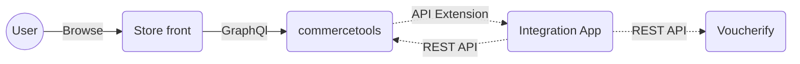
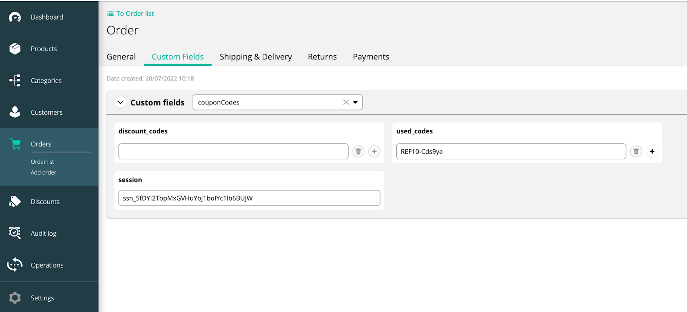

# commerce-tools-integration

[]()
[]()
[]()

Voucherify's [commercetools](https://commercetools.com/) connector extends its discount capabilities with unique promo codes and advanced incentives, as well as with referral, gift card, and loyalty programs supported by [Voucherify promotion engine](https://www.voucherify.io).

Demo store https://github.com/voucherifyio/sunrise-for-commerce-tools-integration/


---

* [How does the integration between Voucherify and commercetools work?](#how-does-the-integration-between-voucherify-and-commercetools-work)
* [How to work with commercetools API Extensions?](#how-to-work-with-commercetools-api-extensions)
* [Prerequisites](#prerequisites)
* [Cart updates](#cart-updates)
* [How set up the development environment?](#how-set-up-the-development-environment)
* [Installation and configuration guide](#installation-and-configuration-guide)
  + [Dependencies](#dependencies)
  + [Configuration](#configuration)
  + [Installation](#installation)
    - For production
    - For local development (ngrok required)
    - For development with public URL
* [Tests](#tests)
* [CLI](#cli)
* [REST API Endpoints](#rest-api-endpoints)
* [Heroku deployment](#heroku-deployment)
  + [Requirements](#requirements)
  + [Configuration](#configuration)
  + [Deployment](#deployment)
    - [Fork](#fork)
    - [New repository](#new-repository)
  + [Configure commercetools](#configure-commercetools)
  + [Register API Extension](#register-api-extension)
* [Typical use case](#typical-use-case)
* [Contributing](#contributing)
* [Changelog](#changelog)
* [Contact](#contact)
* [Final words](#final-words)
* [Licence](#licence)

## How does the integration between Voucherify and commercetools work?

The integration between Voucherify and commercetools allows your customers to use Voucherify-generated promotions in a store built on top of commercetools. We currently support all types of coupon campaign and we are working to fully support referral programs, gift cards, cart-level promotions, loyalty programs and giveaways.

We support coupons campaigns, including:

- [Validation sessions](https://docs.voucherify.io/docs/locking-validation-session) – temporarily lock the voucher's usage until redemption is successful, which is helpful for coupons with limited use.
- [Stackable discounts](https://docs.voucherify.io/docs/manage-stackable-discounts) – allow customers to use up to 5 coupons at the same time.
- [Validation rules](https://docs.voucherify.io/docs/validation-rules) – coupons valid only for select scenarios based on customer, cart or order attributes.
- [Discount effects](https://docs.voucherify.io/docs/discount-effects) – defining how to apply the discount to the customer's cart.
- [Unit discount](https://docs.voucherify.io/docs/give-item-for-free-unit-discount) – add free items to orders.

If we want to allow customers to use coupons defined in Voucherify, the integration application needs to:

1. Watch cart updates on the commercetools’ side. If a customer adds a coupon code, use Voucherify API to validate coupons, get discount details and apply discounts back to the commercetools cart.
2. Record fulfilled orders from commercetools on the Voucherify’s side using Voucherify redeem endpoint.


In addition, we suggest synchronizing your customer, product, and order data between commercetools and Voucherify, so you can use that data to build more advanced promotion campaigns. 


## How to work with commercetools API Extensions?

Our integration uses [commercetools API Extensions](https://docs.commercetools.com/api/projects/api-extensions) to monitor cart and order updates. But, before commercetools can send us HTTP requests with cart and order update details, we need to register API Extension and let commercetools know under which public URL our integration is available. There are two scenarios. First, if you run the integration on a publicly available server, you can register or unregister commercetools API Extension using `npm run api-extension-add`, `npm run api-extension-delete` or `npm run api-extension-update` commands. Those commands use the APP_URL environment variable as the public server address where commercetools will send cart and order updates. The second scenario is when you develop or test integration locally, and your PC does not have public IP or domain. In that case, you need to use a reverse proxy (e.g., ngrok) solution to expose your local integration application. To simplify this process, we built a script npm run dev:attach that runs an ngrok reverse proxy service, uses a randomly generated ngrok public URL to register API Extension in commercetools and start our application.



Please note:

1. commercetools API Extensions pointing to the server that does not respond or does not exist will block your commercetools API. Therefore, you must ensure that you have registered in commercetools only required API Extensions pointing to working servers. You can list currently registered API Extensions using `npm run api-extension-list` command.
2. `npm run api-extension-delete` and `npm run api-extension-update` commands recognize their own API Extension records by the `key` value configured in COMMERCE_TOOLS_API_EXTENSION_KEY environment variable (default value is `VOUCHERIFY_INTEGRATION`

## Cart updates

Handling API Extensions request from commercetools with information about cart update is the heart of the integration. Upon receiving cart update requests, the integration app will:

- Set custom cart fields definition for newly created carts where we will keep information about applied discounts. 
- Validate discounts using Voucherify API, sending collected information about cart items and discount codes.
- Update cart custom fields with the data which coupons were applied or not.
- Apply the percentage or amount discount to the cart by adding a custom line item.
- Add required promotional products to the cart (if unit type discount is used).

Please note that by putting information about applied discount codes in the cart custom fields, we bypass the commercetools Discount Codes feature. This approach lets us prevent confusing Voucherify with commercetools discounts but also requires little changes on the store frontend that uses commercetools API. Primarily, you had to change how you add and read discount codes from commercetools API and use the discount_codes cart custom field instead of the commercetools addDiscountCode action. For development purposes, we prepared [Sunrise Storefront for Commercetools adjusted to work with discount coupons managed by Voucherify](https://github.com/voucherifyio/sunrise-for-commerce-tools-integration). The [README.md](https://github.com/voucherifyio/sunrise-for-commerce-tools-integration/blob/main/README.md) file describes all required changes in detail.

## How set up the development environment?

1. Create new Voucherify and commercetools trial accounts.
2. Load test data to commercetools using [Sunrise Data](https://github.com/commercetools/commercetools-sunrise-data) project and follow instructions in the README.md file.
3. Install the integration app locally following the [Installation and configuration guide](#installation-and-configuration-guide).
4. Install [Sunrise Storefront](https://github.com/voucherifyio/sunrise-for-commerce-tools-integration) adjusted to work with Voucherify discounts, following the instruction from the "Installation" section of the README.md file. 

## Prerequisites

- Voucherify [account](http://app.voucherify.io/#/signup) and [API keys](https://docs.voucherify.io/docs/authentication)
- commercetools [account](https://commercetools.com/free-trial) with API Client and API keys

## Installation and configuration guide

### Dependencies
- Node.js >= 16.15.0
- npm >= 8.5.5

### Configuration

Set environment variables with credentials to Voucherify and commercetools APIs. For local development, put the configuration into `.env` file (see `.env.example` configuration template).
- `APP_URL` - a public URL where the application is hosted. commercetools will use this URL to make [API Extension HTTP requests](https://docs.commercetools.com/api/projects/api-extensions). This configuration is ignored for local development servers as ngrok provides a public URL dynamically. 
- In Voucherify, go to `Project Dashboard > Project Settings > General Tab > Application Keys`.
    - `VOUCHERIFY_APP_ID`
    - `VOUCHERIFY_SECRET_KEY`
    - `VOUCHERIFY_API_URL`
- In commercetools, credentials are available when a new API Client is created. You can create it in `Settings > Developer Settings > Create new API client (top right corner)` using the `Admin client` scope template.
    - `COMMERCE_TOOLS_PROJECT_KEY`
    - `COMMERCE_TOOLS_AUTH_URL`
    - `COMMERCE_TOOLS_API_URL`
    - `COMMERCE_TOOLS_ID`
    - `COMMERCE_TOOLS_SECRET`
- Additional configuration variables
    - `COMMERCE_TOOLS_PRODUCTS_CURRENCY` - (e.g. EUR) [*]
    - (optional) `COMMERCE_TOOLS_API_EXTENSION_KEY` - value used in API Extension `key` attribute used to recognize its own API Extension records, default value is: `VOUCHERIFY_INTEGRATION`
    - (optional) `COMMERCE_TOOLS_PRODUCTS_COUNTRY` - (e.g. DE) [*]
    - (optional) `COMMERCE_TOOLS_PRODUCT_CHANNEL` - (e.g. Store London) [*]
    - (optional) `COMMERCE_TOOLS_PRODUCT_CUSTOMER_GROUP` - (e.g. b2b) [*]
    - (optional) `LOGGER_PRETTY_PRINT` - `true` to get console output in the text format (JSON by default).
    - (optional) `COMMERCE_TOOLS_WITH_LOGGER_MIDDLEWARE` - `false` to disable debugger mode in commercetools connector.
    - (optional) `API_EXTENSION_BASIC_AUTH_PASSWORD` - (`String`) protects your API Extension URL from unwanted traffic.
    - (optional) `CUSTOM_NGROK_BIN_PATH` - a custom path to your ngrok binary file e.g /opt/homebrew/bin for Macbook M1 cpu
    - (optional) `PORT` - application port (default is 3000)
    - (optional) `LOGGER_LEVEL` - logging level for `npm run test`. You can set it to `error` or `fatal`.
    - (optional) `DEBUG_STORE_REQUESTS_IN_JSON` - `true` if you want to keep external requests / response in a JSON file.
    - (optional) `DEBUG_STORE_REQUESTS_DIR` - name of the directory where JSON files with request / responses are stored.

[*] Variables used to select suitable price per product in your shop. Due to the fact that in the commercetools can be a lot of possible prices per one product, but in Voucherify there is only one, it is needed to choose the proper price. You can find proper values by searching in `*any product* > Variants > *any variant* > Prices` for rows which have proper price scope for your project. Depending on the situation you may need to use all of four variables or less, but at least the COMMERCE_TOOLS_PRODUCTS_CURRENCY variable is required. In case when you do not choose the right values, then some functionalities won't work properly (e.g. adding free item with coupon). [Here](https://docs.commercetools.com/api/projects/products#price-selection) you can read more about commercetools mechanism called "Price Selection" which we used.

### Installation

Set up the configuration for the first run.
```
npm run config
```

#### For production
```bash
npm install
npm run start
npm run register
```

#### For local development (ngrok required)
```bash
npm install
npm run dev:attach 
```

#### For development with public URL
```bash
npm install
npm run dev
npm run register
```
---

## Tests

`npm run test`

Currently we cover the following scenarios:
- creating a new cart (cart.version = 1)
- running API extension without any applied coupons (testing integration between V% and CT)
- running API extension when removing currently applied coupons
- adding an amount type coupon
- adding a percentage type coupon
- adding the same single use coupon in a different session
- adding coupons which don't exist
- adding a second amount type coupons right after a percentage type coupon
- changing the quantity of products with an applied amount and percentage type coupons

## CLI

- `npm run start` - start the application in production mode
- `npm run dev` - start the application in development mode
- `npm run api-extension-add` - add commercetools API Extension pointing to your server (server url is taken from APP_URL environment variable)
- `npm run api-extension-delete` - remove commercetools API Extension by Key value configured in COMMERCE_TOOLS_API_EXTENSION_KEY environment variable. Optionaly you can provide specific API Extension Id by `npm run api-extension-delete -- --id=xxx-xxx-xxx`
- `npm run api-extension-update` - remove old and add new API Extension pointing to your server, url is taken from APP_URL environment variable, old API Extension is recognized by API Extension key configured by COMMERCE_TOOLS_API_EXTENSION_KEY environment variable
- `npm run api-extension-list` - list all commercetools API Extensions
- `npm run dev:attach` - start the application in development mode including:
    - launching ngrok and collecting dynamically generated URL
    - updating commercetools API Extension to point to our development server
- `npm run config` - set up the required basic configuration in commercetools:
    1. custom coupon type - needed to store coupons codes inside the [Cart](https://docs.commercetools.com/api/projects/carts) object
    2. coupon tax category - needed for any coupon or gift card with a fixed amount discount
- `npm run test` - run Jest tests
- `npm run migrate` - migrate data from commercetools to Voucherify. Arguments:
    - `type` - required - type of data which you want to migrate. Values: `products`, `orders`, `customers`
    - `days` - optional - set number of days to sync from the past. Value: `number`
    - `hours` - optional - set number of hours to sync from the past. Value: `number`
    - `ms` - optional - set number of milliseconds to sync from the past. Value: `number`
    - `date` - optional - set date from which the resources are to be migrated. Format: `YYYY-MM-DD`
    - `longdate` - optional - set date and time from which the resources are to be migrated. Format: `YYYY-MM-DDTHH:MM:SS` \
    Examples: 
    - `npm run migrate -- --type=products`
    - `npm run migrate -- --type=orders --days=5`
    - `npm run migrate -- --type=customers --longdate=2022-03-21T21:04:37`

## REST API Endpoints

- `GET /` - welcome application message
- `POST /api-extension` - handle API extension requests (cart) from commercetools
- `POST /types/configure` - trigger coupon types configuration
- `POST /tax-categories/configure` - trigger coupon tax configuration

---

## Heroku deployment

### Requirements

- [Heroku CLI](https://devcenter.heroku.com/articles/heroku-cli)
- [Git](https://devcenter.heroku.com/articles/heroku-cli) installed

### Configuration

1. Create a new application on your Heroku account with a given <application_name>
2. Go to your <application_name> -> Settings -> Reveal Config Vars
3. Configure your commercetools application and set up environment variables [see Configuration](#configuration)

### Deployment


#### Fork
1. Fork this repository
2. Clone your fork
```bash
git clone <fork_name>
```
3. Login to your Heroku account
```bash
heroku login
```
4. Create a remote branch for Heroku deploy 
```bash
heroku git:remote -a <application_name>
```
5. You don't need to create any procfile. By default, Heroku recognizes package.json and run `npm install` and `npm start`.
6. Deploy the code
```bash
git push heroku master # For master branch
git push heroku main # For main branch
git push heroku <branch_name>:main # For other branch
```

#### New repository

1. Go to the source code folder
2. Login to Heroku account
```bash
heroku login
```
3. Init git repository
```bash
git init
git add .
git commit -m "Init"
```
4. Create a remote branch for Heroku deploy 
```bash
heroku git:remote -a <application_name>
```
5. Deploy the code
```bash
git push heroku master # For master branch
git push heroku main # For main branch
git push heroku <branch_name>:main # For other branch
```

### Configure commercetools

1. Go to your <application_name> -> More -> Run console
2. Run `npm run config` 

This command should be run once for every commercetools application.

### Register API Extension

1. Go to your <application_name> -> More -> Run console
2. Run `npm run api-extension-add` 

This command should be run once (or each time after `npm run api-extension-delete`).

### Sync
Data migration allows us to handle more advanced features of Voucherify, so it is important to keep data updated (however it is still optional if you use only basic functionalities). Migration is done via `npm run migrate` commands. When you are launching the integration app the first time you should fetch all data (`products`, `orders`, `customers`). After that to keep Voucherify updated it will be convenient to sync data once in a while. To not process all of the data each time you can pass additional arguments (e.g. `days`, `date`) to shorten the sync period and as a result decrease time of these operations. You can do it manually, but we highly recommend automating this process with some tool like `Cron`. The period between syncs should depend on traffic on your platform or the time when new vouchers, campaigns, etc. are created to make them as close to the newest data as possible.

## Typical use case

1. As a customer who opens a store page in the browser (Sunrise Storefront), I add some products to the cart and on the cart page, I add one of the available coupon codes (you can check the available discounts in the Voucherify admin panel for trial accounts you should have preconfigured, e.g., BLACKFRIDAY code).
2. As a customer who added an existing coupon code, I should see the granted discount value and be able to finish the order.
3. As the store operator logged into the commercetools panel, I see new orders, including applied coupon codes on the Custom Fields tab and applied coupon discount value in the Order items list.
4. As the store operator logged into the commercetools panel when I update Order Payment Status to Paid, customer, order, and redeemed objects are created in Voucherify.





---

## Contributing

If you found a bug or want to suggest a new feature, please file a Github issue.

## Changelog

- 2022-08-03 `v2.0.1`
    - added sync of customers who made an order without account
    - enhanced CLI: removing three `migrate-...` commands and replace them with one `migrate` with several options
    - added migration of metadata: as metadata from commercetools side are considered `custom fields` in case of `orders` and `customers` and `attributes` in case of `products`
    - readme update

- 2022-08-02 `v2.0.0`
    - version v2.x is not fully backward compatible with version v1.x, please refer to [Migration from v1.x.x to v2.x.x](#migration-from-v1xx-to-v2xx) section
    - fixing the issue with removing the commercetools API Extension pointing to other integrations
    - removed CLI commands: `register` and `unregister`
    - added CLI commands: `api-extension-add`, `api-extension-update`, `api-extension-delete` and `api-extension-list`
    - added new optional configuration (`COMMERCE_TOOLS_API_EXTENSION_KEY` environment variable) to recognize own commercetools API Extension from 3rd party ones when performing delete or update operations
    - remove coupon from session when coupon is deleted from a cart, it requires [Sunrise Storefront v2.0.0](https://github.com/voucherifyio/sunrise-for-commerce-tools-integration)
- 2022-07-28 `v1.0.1` Update README.md file
- 2022-07-26 `v1.0.0` Initial release

## Migrations

### Migration from v1.x.x to v2.x.x

- replace old commercetools API Extensions pointing to your integration application:
    - list all existing commercetoools API Extension by `npm run api-extension-list` command 
    - if there are existing commercetools API Extensions pointing to your integration app with empty value in `Key` columns, remove this API Extension by `id` value using `npm run api-extension-delete -- --id=xxx-xxx-xx` command
    - ensure that you have configured `APP_URL` environment variable
    - add new API Extension using `npm run api-extension-add` command
- use `npm run api-Extension-update` instead of `npm run register` command
- use `npm run api-Extension-delete` instead of `npm run unregister` command


## Contact

If you have questions, comments, or need help with the code, we're here to help:
* on [Slack](https://www.voucherify.io/community)
* by [email](https://www.voucherify.io/contact-support)

For more tutorials and full API reference, visit Voucherify [Developer Hub](https://docs.voucherify.io).

## Final words

We believe that the commercetools setup can vary between implementations and integration requirements may differ in each case. Because of that, we distributed integration between Voucherify and commercetools as an open source application so that everyone can download, host, and adjust the solution to their unique business requirements.

## Licence
[MIT](./LICENSE.md) Copyright (c) 2022 voucherify.io

