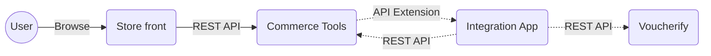

# commerce-tools-integration

[]()
[]()
[]()

This open-source application allows you to integrate [Commerce Tools](https://commercetools.com/?location=emea) (headless e-commerce) with [Voucherify](https://www.voucherify.io) (promotional engine) using their public APIs. This integration enables buyers to use coupons generated and configured in Voucherify in store.




---

## Table of contents

1. [Related applications](#related-applications)
2. [Prerequisites](#prerequisites)
3. [Installation and configuration guide](#installation-and-configuration-guide)
    1. [Dependencies](#dependencies)
    2. [Configuration](#configuration)
    3. [Instalation](#installation)
4. [CLI](#cli)
5. [How to test your app](#how-to-test-your-app)
6. [REST API Endpoints](#rest-api-endpoints)
7. [Heroku deployment](#heroku-deployment)
    1. [Requirements](#requirements)
    2. [Configuration](#Configuration)
    3. [Deployment](#deployment)
    4. [API Extension Registration](#api-extension-registration)
    5. [CT Configuration](#ct-configuration)
8. [Contributing](#contributing)
9. [Contact](#contact)
10. [Licence](#licence)

## Related applications

- Voucherify https://www.voucherify.io
- Commerce Tools https://commercetools.com/?location=emea
- Sunrise for Commerce Tools Integration https://github.com/voucherifyio/sunrise-for-commerce-tools-integration/tree/main

## Prerequisites

Before you begin, ensure you have following requirements

- Voucherify account and valid API keys
- Commerce Tools account with created API Client and valid API keys

## Installation and configuration guide

### Dependencies
- Node.js >= 16.15.0
- npm >= 8.5.5

### Configuration:

Set environment variables with credentials to Voucherify and Commerce Tools APIs. For local development purposes, put configuration into `.env` file (please, look at `.env.example` configuration file template).
- `APP_URL` - the public URL where this application is available. Commerce Tools will use this URL to make API Exteniosn HTTP requests to our integration application. This configuration is ignored for local development servers as ngrok provides this public dynamically. 
- In Voucherify, you can find them in the `Project Dashboard > Project Settings > General Tab > Application Keys` section.
    - `VOUCHERIFY_APP_ID`
    - `VOUCHERIFY_SECRET_KEY`
    - `VOUCHERIFY_API_URL`
- In Commerce Tools, credentials are available only once; after new API Client creation. You can create a new API Client in `Settings > Developer Settings > Create new API client (top right corner)` using the `Admin client` scope template.
    - `COMMERCE_TOOLS_PROJECT_KEY`
    - `COMMERCE_TOOLS_AUTH_URL`
    - `COMMERCE_TOOLS_API_URL`
    - `COMMERCE_TOOLS_ID`
    - `COMMERCE_TOOLS_SECRET`
- Additional configuration variables
    - `COMMERCE_TOOLS_PRODUCTS_CURRENCY` - (e.g. EUR) - needed to select proper prices when syncing products. This one variable is required for this process, it can be found in `*any product* > Variants > *any variant* > Prices (column currency, row adequate to prices in your shop)`.
    - (optional) `COMMERCE_TOOLS_PRODUCTS_COUNTRY` - (e.g. DE) - needed to select proper prices when syncing products. It can be found similiar to above example.
    - (optional) `COMMERCE_TOOLS_PRODUCT_CHANNEL` - (e.g. Store London) - needed to select proper prices when syncing products. It can be found similiar to above example.
    - (optional) `COMMERCE_TOOLS_PRODUCT_CUSTOMER_GROUP` - (e.g. b2b) - needed to select proper prices when syncing products. It can be found similiar to above example.
    - (optional) `LOGGER_PRETTY_PRINT` - set environment variable to `true`, to have console output in a text format (by default it is in JSON format).
    - (optional) `COMMERCE_TOOLS_WITH_LOGGER_MIDDLEWARE` - set environment variable to `false`, to disable debugger mode in commerce tools connector.
    - (optional) `API_EXTENSION_BASIC_AUTH_PASSWORD` - set to any `String`, it will protect your exposed API Extension URL from unwanted traffic.
    - (optional) `CUSTOM_NGROK_BIN_PATH` - set if want to use custom path to Your ngrok binary file e.g /opt/homebrew/bin for Macbook M1 cpu
    - (optional) `PORT` - set application port (default is 3000)
    - (optional) `LOGGER_LEVEL` - setting lever of errors that will be login with npm run test. You can set it to `error` or `fatal` 
### Instalation

If you use Your CT Application for the first time be sure to make basic confgiuration with in your Commerce Tools application (provided by API keys).
```
npm run config
```

Then go for to following steps depends on the environment

#### For production
```bash
npm install
npm run start
npm run register
```

#### For local development (ngrok required)
```bash
npm install
npm run dev:attach 
```

#### For developement with public URL
```bash
npm install
npm run dev
npm run register
```
---

## How to test your app

To test application you can simply run `npm run test` command. Currently we covered following scenarios:
- creating new cart (cart.version = 1)
- runing API extenstion without any applied coupons (testing integration between V% and CT)
- runing API extenstion with removing currently applied coupons
- adding amount type coupon
- adding percentage type coupon
- adding this same single use coupon in different session
- adding coupons which is not exists
- adding second amount type coupons right after percentage type coupon
- changing quantity of products with applied amount and percentage type coupons

## CLI

- `npm run start` - start the application in production mode
- `npm run dev` - start the application in development mode
- `npm run register` - configure Commerce Tools API Extension to point to our development server
- `npm run unregister` - unregister your CT API Extension to allow configurate given URL for other application
- `npm run dev:attach` - start application in development mode including:
    - launching ngrok and collecting dynamically generated URL
    - configure Commerce Tools API Extension to point to our development server
- `npm run config` - it will handle the required basic configuration in Commerce Tools:
    1. custom coupon type - needed to hold coupons codes inside cart object
    2. coupon tax category - needed for any coupon or gift card with a fixed amount discount
- `npm run test` - will run JestJs tests
- `npm run migrate-products` - it will sync all of the products from CT to Voucherify.
    - you can add `period` argument to sync only from last X days (e.g `npm run migrate-products -- --period=5`)
- `npm run migrate-customers` - it will sync all of the customers from CT to Voucherify.
    - you can add `period` argument to sync only from last X days (e.g `npm run migrate-customers -- --period=5`)
- `npm run migrate-orders` - it will sync all of the (paid) orders from CT to Voucherify. It is important to know that due to some restrictions speed of this operation is decreased.
    - you can add `period` argument to sync only from last X days (e.g `npm run migrate-orders -- --period=5`)

## REST API Endpoints

- `GET /` - welcome application messgae
- `POST /api-extension` - handle api extension requests (cart) from Commerce Tools
- `POST /types/configure` - trigger to configure coupon types in Commerce Tools
- `POST /tax-categories/configure` - trigger to configure coupon tax categories in Commerce Tools

---

## Heroku deployment

### Requirements

- [Heroku CLI](https://devcenter.heroku.com/articles/heroku-cli)
- [Git](https://devcenter.heroku.com/articles/heroku-cli) installed

### Configuration

1. Create new application on your Heroku account with given <application_name>
2. Go you your <application_name> -> Settings -> Reveal Config Vars
3. Configurate yor CT Application and post there all needed environment variables which was [mentioned here](#configuration)
    - for your APP_URL it must be URL provided by Heroku four you application. It should be something like https://<application_name>.herokuapp.com 

### Deployment

To install and deploy CT Integration you cant fork this repository or download source code and init new Git repository. Both ways are described below.

#### Fork deploy
1. Fork this repository
2. Clone your fork
```bash
git clone <fork_name>
```
3. Login to Heroku account
```bash
heroku login
```
4. Create remote branch for Heroku deploy 
```bash
heroku git:remote -a <application_name>
```
5. You dont need to add any Procfile. By default Heroku recognize package.json and run `npm install` and `npm start` commands.
6. Deploy code
```bash
git push heroku master #for master branch
git push heroku main #for main branch
git push heroku <branch_name>:main #for other branch
```

#### New repository deploy
If you dont want to use fork you can initialize new repository
1. Go to folder with your source code
2. Login to Heroku account
```bash
heroku login
```
3. Init git repository
```bash
git init
git add .
git commit -m "Init"
```
5. Follow steps 4-7 from [Fork deploy](#fork-deploy)

### API Extension Registration

After successful deploy application, the last step You need to do is to register your API Extension. You can do it by Heroku CLI.

1. Go you your <application_name> -> More -> Run console
2. Run command `npm run register` 

This command need to be done only once. Unless you run command `npm run unregister`.

### CT Configuration

If you use Your CT Application for the first time, You need to configurate it.

1. Go you your <application_name> -> More -> Run console
2. Run command `npm run config` 

This command need to be done only once or if You want to use new CT Application with new credentials.

---

## Contributing

Bug reports and pull requests are welcome through [GitHub Issues](https://github.com/voucherifyio/commerce-tools-integration).

## Contact

Use our contact form https://www.voucherify.io/contact-sales

## Licence
[MIT](./LICENSE.md) Copyright (c) 2022 voucherify.io