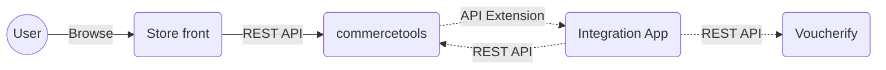

# commerce-tools-integration

[]()
[]()
[]()

Voucherify's [commercetools](https://commercetools.com/) connector extends its discount capabilities with unique promo codes and advanced incentives, as well as with referral, gift card, and loyalty programs supported by [Voucherify promotion engine](https://www.voucherify.io).

Demo store https://github.com/voucherifyio/sunrise-for-commerce-tools-integration/




---

* [Prerequisites](#prerequisites)
* [Installation and configuration guide](#installation-and-configuration-guide)
  + [Dependencies](#dependencies)
  + [Configuration](#configuration)
  + [Installation](#installation)
    - For production
    - For local development (ngrok required)
    - For development with public URL
* [Tests](#tests)
* [CLI](#cli)
* [REST API Endpoints](#rest-api-endpoints)
* [Heroku deployment](#heroku-deployment)
  + [Requirements](#requirements)
  + [Configuration](#configuration)
  + [Deployment](#deployment)
    - [Fork](#fork)
    - [New repository](#new-repository)
  + [Configure commercetools](#configure-commercetools)
  + [Register API Extension](#register-api-extension)
* [Contributing](#contributing)
* [Contact](#contact)
* [Licence](#licence)

## Prerequisites

- Voucherify [account](http://app.voucherify.io/#/signup) and [API keys](https://docs.voucherify.io/docs/authentication)
- commercetools [account](https://commercetools.com/free-trial) with API Client and API keys

## Installation and configuration guide

### Dependencies
- Node.js >= 16.15.0
- npm >= 8.5.5

### Configuration

Set environment variables with credentials to Voucherify and commercetools APIs. For local development, put the configuration into `.env` file (see `.env.example` configuration template).
- `APP_URL` - a public URL where the application is hosted. commercetools will use this URL to make [API Extension HTTP requests](https://docs.commercetools.com/api/projects/api-extensions). This configuration is ignored for local development servers as ngrok provides a public URL dynamically. 
- In Voucherify, go to `Project Dashboard > Project Settings > General Tab > Application Keys`.
    - `VOUCHERIFY_APP_ID`
    - `VOUCHERIFY_SECRET_KEY`
    - `VOUCHERIFY_API_URL`
- In commercetools, credentials are available when a new API Client is created. You can create it in `Settings > Developer Settings > Create new API client (top right corner)` using the `Admin client` scope template.
    - `COMMERCE_TOOLS_PROJECT_KEY`
    - `COMMERCE_TOOLS_AUTH_URL`
    - `COMMERCE_TOOLS_API_URL`
    - `COMMERCE_TOOLS_ID`
    - `COMMERCE_TOOLS_SECRET`
- Additional configuration variables
    - `COMMERCE_TOOLS_PRODUCTS_CURRENCY` - (e.g. EUR) - required to select proper prices when syncing products (can be found in `*any product* > Variants > *any variant* > Prices (column currency, row adequate to prices in your shop)`).
    - (optional) `COMMERCE_TOOLS_PRODUCTS_COUNTRY` - (e.g. DE)
    - (optional) `COMMERCE_TOOLS_PRODUCT_CHANNEL` - (e.g. Store London)
    - (optional) `COMMERCE_TOOLS_PRODUCT_CUSTOMER_GROUP` - (e.g. b2b)
    - (optional) `COMMERCE_TOOLS_WITH_LOGGER_MIDDLEWARE` - `false` to disable debugger mode in commercetools connector.
    - (optional) `API_EXTENSION_BASIC_AUTH_PASSWORD` - (`String`) protects your API Extension URL from unwanted traffic.
    - (optional) `CUSTOM_NGROK_BIN_PATH` - a custom path to your ngrok binary file e.g /opt/homebrew/bin for Macbook M1 cpu
    - (optional) `PORT` - application port (default is 3000)
    - (optional) `LOGGER_LEVEL` - logging level for `npm run test`. You can set it to `error` or `fatal`.
    - (optional) `DEBUG_STORE_REQUESTS_IN_JSON` - `true` if you want to keep external requests / response in a JSON file.
    - (optional) `DEBUG_STORE_REQUESTS_DIR` - name of the directory where JSON files with request / responses are stored.

### Installation

Set up the configuration for the first run.
```
npm run config
```

#### For production
```bash
npm install
npm run start
npm run register
```

#### For local development (ngrok required)
```bash
npm install
npm run dev:attach 
```

#### For development with public URL
```bash
npm install
npm run dev
npm run register
```
---

## Tests

`npm run test`

Currently we cover the following scenarios:
- creating a new cart (cart.version = 1)
- running API extension without any applied coupons (testing integration between V% and CT)
- running API extension when removing currently applied coupons
- adding an amount type coupon
- adding a percentage type coupon
- adding the same single use coupon in a different session
- adding coupons which don't exist
- adding a second amount type coupons right after a percentage type coupon
- changing the quantity of products with an applied amount and percentage type coupons

## CLI

- `npm run start` - start the application in production mode
- `npm run dev` - start the application in development mode
- `npm run register` - configure commercetools API Extension to point to your development server
- `npm run unregister` - unregister commercetools API Extension
- `npm run dev:attach` - start the application in development mode including:
    - launching ngrok and collecting dynamically generated URL
    - configuring commercetools API Extension to point to our development server
- `npm run config` - set up the required basic configuration in commercetools:
    1. custom coupon type - needed to store coupons codes inside the [Cart](https://docs.commercetools.com/api/projects/carts) object
    2. coupon tax category - needed for any coupon or gift card with a fixed amount discount
- `npm run test` - run Jest tests
- `npm run migrate-products` - it will sync all of the products from CT to Voucherify.
- `npm run migrate-customers` - it will sync all of the customers from CT to Voucherify.
- `npm run migrate-orders` - it will sync all of the (paid) orders from CT to Voucherify. It is important to know that due to some restrictions speed of this operation is decreased.
    - you can add additional arguments to above migrate commands to sync data from fixed time in the past. Available options are: `days`, `hours`, `ms` (these three will sync data from time period set by subtracting current date and passed argument) `date`, `longdate` (these will sync data from passed date). Examples:
        - `npm run migrate-orders -- --days=5`
        - `npm run migrate-customers -- --hours=13`
        - `npm run migrate-orders -- --date=2022-03-12`
        - `npm run migrate-products -- --longdate=2022-03-12T06:22:33`


## REST API Endpoints

- `GET /` - welcome application message
- `POST /api-extension` - handle API extension requests (cart) from commercetools
- `POST /types/configure` - trigger coupon types configuration
- `POST /tax-categories/configure` - trigger coupon tax configuration

---

## Heroku deployment

### Requirements

- [Heroku CLI](https://devcenter.heroku.com/articles/heroku-cli)
- [Git](https://devcenter.heroku.com/articles/heroku-cli) installed

### Configuration

1. Create a new application on your Heroku account with a given <application_name>
2. Go to your <application_name> -> Settings -> Reveal Config Vars
3. Configure your commercetools application and set up environment variables [see Configuration](#configuration)

### Deployment


#### Fork
1. Fork this repository
2. Clone your fork
```bash
git clone <fork_name>
```
3. Login to your Heroku account
```bash
heroku login
```
4. Create a remote branch for Heroku deploy 
```bash
heroku git:remote -a <application_name>
```
5. You don't need to create any procfile. By default, Heroku recognizes package.json and run `npm install` and `npm start`.
6. Deploy the code
```bash
git push heroku master # For master branch
git push heroku main # For main branch
git push heroku <branch_name>:main # For other branch
```

#### New repository

1. Go to the source code folder
2. Login to Heroku account
```bash
heroku login
```
3. Init git repository
```bash
git init
git add .
git commit -m "Init"
```
4. Create a remote branch for Heroku deploy 
```bash
heroku git:remote -a <application_name>
```
5. Deploy the code
```bash
git push heroku master # For master branch
git push heroku main # For main branch
git push heroku <branch_name>:main # For other branch
```

### Configure commercetools

1. Go to your <application_name> -> More -> Run console
2. Run `npm run config` 

This command should be run once for every commercetool application.

### Register API Extension

1. Go to your <application_name> -> More -> Run console
2. Run `npm run register` 

This command should be run once (or each time after `npm run unregister`).

---

## Contributing

If you found a bug or want to suggest a new feature, please file a Github issue.

## Contact

If you have questions, comments, or need help with the code, we're here to help:
* on [Slack](https://www.voucherify.io/community)
* by [email](https://www.voucherify.io/contact-support)

For more tutorials and full API reference, visit Voucherify [Developer Hub](https://docs.voucherify.io).

## Licence
[MIT](./LICENSE.md) Copyright (c) 2022 voucherify.io
