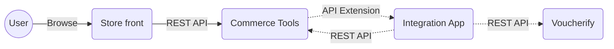
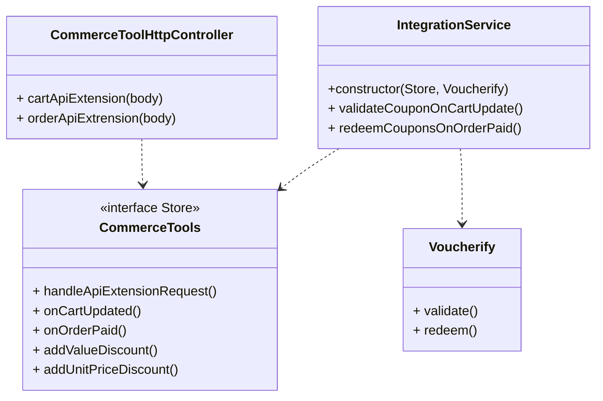

## Table of contents

1. [Introduction](#1-installation-and-configuration-guide)
2. [Installation and configuration guide](#2-installation-and-configuration-guide)
3. [CLI](#3-cli)
4. [How to test your app](#4-how-to-test-your-app)
 
# 1. Introduction

This open-source application allows you to integrate Commerce Tools (headless e-commerce) with Voucherify (promotional engine) using their public APIs. This integration enables buyers to use coupons generated and configured in Voucherify in store.




## 2. Installation and configuration guide

### Dependencies
- Node.js >= 16.15.0
- npm >= 8.5.5

### Manual product migration from CommerceTools to Voucherify
- Go to https://impex.commercetools.com/
- Login with your merchant account credentials
- Click `Commands` on a dropdown list button from the top bar and select `Product exporter`
- Prepare two .csv files
    - open Google Sheets, Microsoft Excel or similiar program
    - create new file
    - in first row in first document insert following texts (each in new column): `id`, `name.en`
    - in first row in second document insert following texts (each in new column): `id`, `name.en`, `sku`, `prices`
    - save file
- Upload first file to Impex
- Select `Export only masterVariants`
- Click run command and wait for a moment
- After action was completed, click `Download file`
- Upload second file to Impex
- Select `Fill all variant rows with product information` checkbox
- Click run command and wait for a moment
- After action was completed, click `Download file`
- Parse second file - whatever is in `prices` column, you have to change it to be one number (integer or float) with proper price
- Go to https://www.voucherify.io/ and login
- Select `Products` from the left panel
- Click `Import` (top right corner)
- Choose `Import Products` and `Import`
- Upload first file previously downloaded from Impex and click `Map fields`
    - `id` => `Source id`
    - `name.en` => `Name`
- Click `Import` and wait (it can take a moment)
- Again select `Products` from the left panel
- Click `Import` (top right corner)
- Choose `Import Skus` and `Import`
- Upload second file, click `Map fields`
    - `id` => `Product id`
    - `name.en` => `SKU`
    - `sku` => `Source id`
    - `prices` => `Price`
- Click `Import` and wait
- Import should be successfull

### Automatic product migration
Each time command `npm run config` is run, all products and orders are migrated from Commerce Tools to Voucherify. However you can also use `npm run migrate-products` and `npm run migrate-orders` to migrate them whenever you want, additionally you can pass argument `npm run migrate-products -- --period=X` to migrate products which where created in the last X days. The same apply to order migration (e.g. `npm run migrate-orders -- --period=5`)
### Installatio steps:

- Install dependencies via CLI: `npm i`
- Set environment variables with credentials to Voucherify and Commerce Tools APIs. For local development purposes, put configuration into `.env` file (please, look at `.env.example` configuration file template).
    - `APP_URL` - the public URL where this application is available. Commerce Tools will use this URL to make API Exteniosn HTTP requests to our integration application. This configuration is ignored for local development servers as ngrok provides this public dynamically. 
    - In Voucherify, you can find them in the `Project Dashboard > Project Settings > General Tab > Application Keys` section.
        - `VOUCHERIFY_APP_ID`
        - `VOUCHERIFY_SECRET_KEY`
    - In Commerce Tools, credentials are available only once; after new API Client creation. You can create a new API Client in `Settings > Developer Settings > Create new API client (top right corner)` using the `Admin client` scope template.
        - `COMMERCE_TOOLS_PROJECT_KEY`
        - `COMMERCE_TOOLS_AUTH_URL`
        - `COMMERCE_TOOLS_API_URL`
        - `COMMERCE_TOOLS_ID`
        - `COMMERCE_TOOLS_SECRET`

    - To make possible products auto migration you have to set at least one of below env variables to indicate right price for products
        - `COMMERCE_TOOLS_PRODUCTS_CURRENCY`
        - `COMMERCE_TOOLS_PRODUCTS_COUNTRY`
        - `COMMERCE_TOOLS_PRODUCT_CHANNEL`
        - `COMMERCE_TOOLS_PRODUCT_CUSTOMER_GROUP`

    - Additional configuration variables
        - (optional) `LOGGER_PRETTY_PRINT` - set environment variable to `true`, to have console output in a text format (by default it is in JSON format).
        - (optional) `COMMERCE_TOOLS_WITH_LOGGER_MIDDLEWARE` - set environment variable to `false`, to disable debugger mode in commerce tools connector.
        - (optional) `API_EXTENSION_BASIC_AUTH_PASSWORD` - set to any `String`, it will protect your exposed API Extension URL from unwanted traffic.
For local development, you need to publicly expose your local environment so that Commerce Tools can make an API Extension HTTP request to your server. We suggest installing `ngrok` for that purpose by following the installation process described here: https://ngrok.com/docs/getting-started

---

## 3. CLI

- `npm run start` - start the application in production mode
- `npm run dev` - start the application in development mode
- `npm run dev:attach` - start application in development mode including:
    - launching ngrok and collecting dynamically generated URL
    - configure Commerce Tools API Extension to point to our development server
- `npm run config` - it will handle the required basic configuration in Commerce Tools:
    1. custom coupon type - needed to hold coupons codes inside cart object
    2. coupon tax category - needed for any coupon or gift card with a fixed amount discount
- `npm run test` - will run JestJs tests

## 4. How to test your app

@todo

## 5. REST API Endpoints

- `GET /` - welcome application messgae
- `POST /api-extension` - handle api extension requests (cart) from Commerce Tools
- `POST /types/configure` - trigger to configure coupon types in Commerce Tools
- `POST /tax-categories/configure` - trigger to configure coupon tax categories in Commerce Tools
 

 ## Refactoring proposal


 

```ts

// Store interface

interface StoreInterface {
    onCartUpdated: async (cart, customer) => void
    onOrderUpdated: async (order, customer) => void
    addValueDiscount: async discount => void
    addUnitsDiscount: async products => void
}


// Integration service

class IntegrationService{
    constructor(private stores: StoreInterface, private voucherify: Voucherify){
        this.validateCouponOnCartUpdate();
        this.redeemCouponsOnOrderPaid();
    }
    validateCouponOnCartUpdate(){
        this.store.onCartUpdate((cart, customer) => {
            const {valueDiscounts, unitDiscounts} = await this.voucherify.validate(cart);
            if(valueDiscounts){
                return this.store.addValueDiscount()
            }
            if(unitDiscounts){
                return this.store.addDiscountUnits()
            }
        })
    }
    redeemCouponsOnOrderPaid(){
         this.store.onOrderPaid((order, customer) => {
            await this.voucherify.redeem(order, customer);
         })
    }
}


// Store 

type ApiExtensionActions = [] // all posible repsonse actions

class Store { // Request scope
    private cartUpdateHandler;
    onCartUpdate(cartUpdateHandler: (cart, customer) => Promise<ApiExtensionActions[]>){
        this.cartUpdateHandler = cartUpdateHandler;
    }
    
    private orderPaidHandler;
    onOrderPaid(orderPaidHandler: (order, customer) => Promise<ApiExtensionActions[]>){
        this.orderPaidHandler = orderPaidHandler;
    }

    addValueDiscount(valueDiscount){
        const actions: ApiExtensionActions[] = [];
        // logic to add discount
        return actions;
    }
    
    addDiscountUnits(discountUnits){
        const actions: ApiExtensionActions[] = [];
        // logic to add discount units
        return actions;
    }

    handleApiExtensionRequest(apiExtensionData){
        const response:ApiExtensionActions = []; 
        const {cart, order, customer} = someParseFunc(apiExtensionData)
        if(cart){
            return this.cartUpdateHandler(cart, customer)
        }
        if(order){
            return this.orderPaidHandler(order, customer)
        }
    }
}


class ApiControllerExtension {
    constructor(integration:Integration){
        this.store = integration.store
    }

    cartUpdated(body: Body()){
        const actions = this.store.handleApiExtensionRequest(body)
        return actions;
    }
}

```